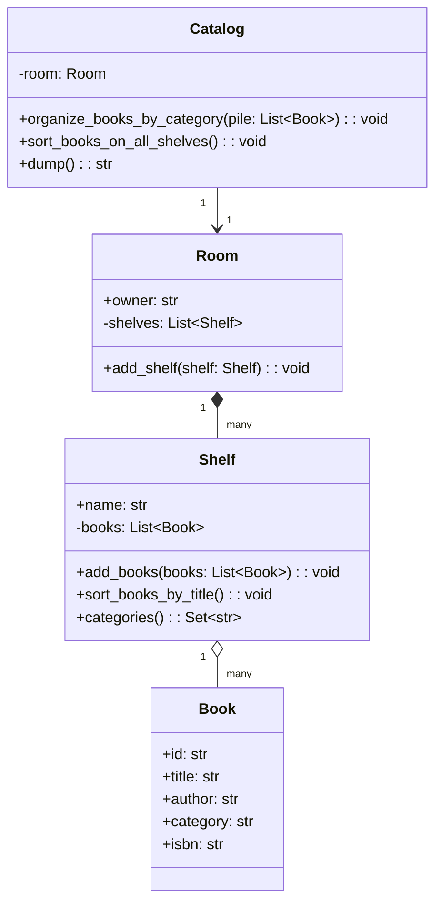

```mermaid
classDiagram
  class Book {
    +id: str
    +title: str
    +author: str
    +category: str
    +isbn: str
  }

  class Shelf {
    +name: str
    -books: List~Book~
    +add_books(books: List~Book~): void
    +sort_books_by_title(): void
    +categories(): Set~str~
  }

  class Room {
    +owner: str
    -shelves: List~Shelf~
    +add_shelf(shelf: Shelf): void
  }

  class Catalog {
    -room: Room
    +organize_books_by_category(pile: List~Book~): void
    +sort_books_on_all_shelves(): void
    +dump(): str
  }

  %% Композиція: кімната "володіє" полицями
  Room "1" *-- "many" Shelf
  %% Агрегація: полиці тримають книги, але книга може існувати й поза полицею
  Shelf "1" o-- "many" Book
  %% Залежність: каталог працює з конкретною кімнатою
  Catalog "1" --> "1" Room
```
